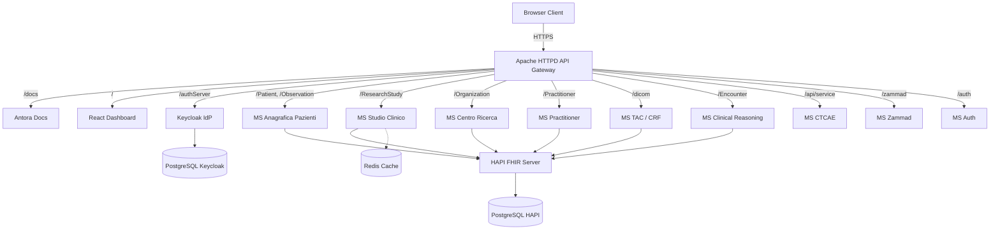
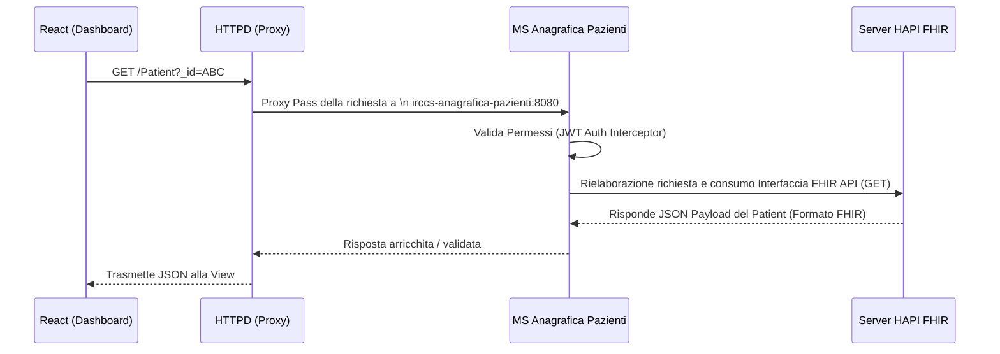

# Documentazione Architetturale del Sistema IRCCS

## 1. Panoramica del Sistema
- **Nome del progetto**: Sistema Informativo IRCCS (Istituto di Ricovero e Cura a Carattere Scientifico)
- **Scopo del sistema**: Piattaforma integrata per la gestione della ricerca clinica, delle anagrafiche dei pazienti, degli studi clinici e dei relativi flussi operativi (Case Report Forms - CRF).
- **Problema che risolve**: Centralizzazione dei dati clinici e di ricerca, garantendo interoperabilità e standardizzazione tramite il protocollo HL7 FHIR.
- **Utenti target**: Data Manager, Ricercatori Clinici, Personale Medico, Amministratori di Sistema.
- **Funzionalità principali**:
  - Gestione Anagrafica Pazienti e Organizzazioni.
  - Creazione e gestione di Studi Clinici e CRF (Questionnaires).
  - Gestione dei flussi di refertazione e imaging (TAC/DICOM).
  - Autenticazione e Autorizzazione centralizzate.
  - Integrazione con sistemi operativi clinici e ticketing (Zammad).

---

## 2. Architettura Complessiva

Il sistema adotta uno stile architetturale a **Microservizi**, orchestrato e installato tramite container Docker. Questa scelta garantisce scalabilità, isolamento rigoroso dei domini applicativi e agilità negli aggiornamenti parziali. 

Tutte le comunicazioni originate dai client (Browser) verso il backend passano per un **Reverse Proxy (Apache HTTPD)** che funge da Gateway e indirizza il traffico al microservizio competente in base alla rotta. Il nucleo dati si basa primariamente su un server **HAPI FHIR**, che rappresenta il sistema di persistenza centralizzato ed esegue validazioni sui dati di tipo eHealth.

### Componenti Principali
- **Frontend Dashboard**: Applicazione interattiva (Single Page Application) sviluppata in React.
- **API Gateway**: Apache HTTPD Server con regole di proxy e cacheusting.
- **Identity Provider (IdP)**: Keycloak per Autenticazione SSO (OIDC) e Autorizzazione (RBAC).
- **Microservizi di Dominio**: Serie di servizi autonomi sviluppati in Java tramite framework Quarkus.
- **FHIR Server**: HAPI FHIR Server configurato per gestire nativamente API HL7, appoggiato su database PostgreSQL.
- **Cache layer**: Server Redis, utile nel caching e per gestione eventuale dell'asincronia.

### Diagramma Architetturale



---

## 3. Descrizione dei Repository

### irccs-docker
- **Scopo**: Punto focale per l'orchestrazione e il deployment dell'intero ecosistema.
- **Responsabilità principali**: Fornire il manifest composito (`docker-compose.yaml`), le configurazioni dell'infrastruttura di rete, i reverse-proxy mapping (`httpd-config`) e la documentazione generativa di Antora.
- **Tecnologie**: Docker, Docker Compose, Apache HTTPD.
- **Dipendenze**: Definisce l'ambiente per richiamare tutti gli altri microservizi.

### irccs-common
- **Scopo**: Codice riusabile interservizio.
- **Responsabilità principali**: Fornire DTO strutturali condivisi, pattern di utility e configurazioni trasversali (es. annotazioni custom `i3-annotations` esportate e consumate dagli altri microservizi).
- **Tecnologie**: Java, Maven.

### irccs-react-dashboard
- **Scopo**: Frontend Single Page Application a consumo degli utenti standard.
- **Responsabilità principali**: Fornire una dashboard visuale e le schermate form-intensive per CRF con React. Svolge chiamate REST per interazione col framework autorizzativo e gateway FHIR.
- **Tecnologie**: React 18, TypeScript, Vite, Material UI (MUI), React Query, E2E in Playwright.

### Microservizi Java Core (Quarkus)

| Nome Repository | Scopo e Responsabilità |
|---|---|
| **irccs-microservice-anagrafica-paziente** | Gestione demografica clinica. Interfaccia logiche complesse rispetto a `Patient`, `Observation`, `AdverseEvent`, `Consent`. |
| **irccs-microservice-studio-clinico** | Cuore del Trial Management. Gestisce le dinamiche tra `ResearchStudy`, refertazione tramite CRF (`Questionnaire`/`QuestionnaireResponse`), `CarePlan`, `Procedure`, ecc. |
| **irccs-microservice-centro-ricerca** | Gestione delle identità relative alle aziende. Si relaziona con entità FHIR `Organization`, `HealthcareService`, `Group`. |
| **irccs-microservice-practitioner** | Gestione del personale medico curante o ricercativo associato allo studio (`Practitioner`, `PractitionerRole`). |
| **irccs-microservice-clinical-reasoning** | Motore per modelli di regole e decisione (`Library`, `Encounter`). |
| **irccs-microservice-crf-tac** | Presumibilmente dedicato a integrazioni documentali estese su base DICOM e Imaging avanzata. (Si associa anche a `microservice-tac`). |
| **irccs-microservice-ctcae** | Dedicato al CTCAE (Common Terminology Criteria for Adverse Events) per monitoraggio e classificazione della tossicità, implementa inoltre endpoint MFA/TOTP (/api/service). |
| **irccs-microservice-auth** | Microservizio complementare all'IdP nativo. Integra logiche di rilascio token su flussi non convenzionali specifici. |
| **irccs-microservice-zammad** | Service wrapper volto a interfacciare la soluzione di IT Service Management / Helpdesk "Zammad". |

---

## 4. Stack Tecnologico

| Layer | Tecnologie Utilizzate |
|---|---|
| **Frontend** | React 18, TypeScript, Vite, Tailwind CSS / Material UI, Plotly.js |
| **Backend Framework** | Java 21, Quarkus (3.x), Maven, REST Assured, HAPI FHIR Client |
| **Database & Cache** | Server HAPI FHIR (HL7 v4/v5), PostgreSQL 16 (Dati FHIR), PostgreSQL 17 (Identità), Redis v7 |
| **Identità & Sicurezza** | Keycloak v26 (OIDC/OAuth 2.0), JWT |
| **Gateway & Docs**| Apache HTTPD, Antora (Generazione documentazione) |
| **Infrastruttura** | Docker, Docker Compose |

---

## 5. Struttura dei Repository

I repository presentano una topologia estremamente standardizzata. 

**Microservizi Backend (Es. `/irccs-microservice-auth`)**
- `/src/main/java`: Codice sorgente applicativo (Service logic, boundary layer).
- `/src/test/java`: Test integrativi (RestAssured, base Docker TestContainers in Quarkus DevServices).
- `/src/docker`: File `Dockerfile` per la pacchettizzazione standard (JVM) o nativa GraalVM (Native-Micro).
- `pom.xml`: Gestore di dipendenze.

**React Frontend (`/irccs-react-dashboard`)**
- `/src`: Composizione gerarchica React (Hooks custom, UI, pagine).
- `/public`: Media assets o bundle grezzi immutati.
- `/tests` / `/e2e`: Rispettivi ambiti di test Unitari (Jest) ed End-to-End browser based (Playwright).
- `vite.config.ts`: Modello di Build front-end.

---

## 6. Flussi Principali del Sistema

### Flusso 1: Single Sign-On e Accesso (OIDC Keycloak)
1. L'utente naviga in dashboard. Se non risulta sessionato, `React App` redirige allo stub `/authServer` offerto in reverse proxy.
2. HTTPD re-indirizza al microservizio **Keycloak**.
3. Keycloak presenta la Login Form; interagisce con il proprio DB PostgreSQL per validazione delle credenziali.
4. Con successo, Keycloak rimanda l'utente alla React App fornendo un *Authorization Code*.
5. La React App scambia l'Auth Code per l'**Access Token JWT** tramite backend o direttamente via front-channel (PKCE).
6. Successivamente le fetch API applicheranno sempre l'header `Bearer <Token>`.

### Flusso 2: Interrogazione Dati Paziente (Domain routing FHIR)



---

## 7. API e Integrazioni

Il sistema **non espone entità legacy ad-hoc**, bensì adotta l'ontologia ufficiale medica globale: **HL7 FHIR**.
*   Tutti gli endpoint rispecchiano i nomi delle Resource FHIR (es. `/Patient`, `/ResearchStudy`, `/Location`).
*   Le risposte avvengono come bundle FHIR in protocollo JSON (es. `application/fhir+json`).
*   **Error Handling**: La gestione degli errori restituisce un oggetto standardizzato FHIR noto come `OperationOutcome`, per evidenziare mancanze di formato (es. codice incoerente rispetto alle SNOMED CT policy).

---

## 8. Modello dei Dati

La progettazione DB non è visibile ai vari microservizi in formato relazionale. Il pattern prevede il delegare la persistenza all'applicativo intermedio *HAPI FHIR* e il suo database PostgreSQL sottostante (spesso gestito come grandi alberi semantici JSONB e tabelle indici ottimizzati `hfj_resource_type`).

**Relazioni di base:**
- **Patient**: Al centro di ogni dato clinico. Si lega ad un `ResearchSubject`.
- **ResearchStudy**: Ciascun protocollo per la ricerca raccoglie svariati "Subject".
- **Questionnaire + QuestionnaireResponse**: L'impostazione "forma e struttura" (Questionario) con i "dati finali" validati e firmati (Response).

---

## 9. Setup e Installazione

Il sistema è pensato parzialmente "Pull on run", dipendendo principalmente dalle immagini Docker.

**Passi iniziali d'ambiente:**
1. Aprire il repository principe: `cd irccs-docker`
2. Clonare l'enviroment: `cp .env.example .env` (Popolare o recuperare i segreti DB, Admin Keycloak).
3. (Opzionale per Dev Front-end puro): `cd ../irccs-react-dashboard` && `npm i`.

**Deployment Locale (Docker Compose):**
1. Eseguire in root directory `irccs-docker`:
   ```bash
   docker-compose down -v
   docker-compose pull
   docker-compose up -d
   ```
2. Attesa per il boot del proxy HTTPD.
3. Accesso locale su `http://localhost/` o il nome a dominio custom in file hosts (es. `backoffice.irccs.infocube.it`).

---

## 10. Configurazione

La flessibilità degli ambienti dipende dalle injection di volumi a runtime:
- Variabili d'Ambiente su root docker: Il file `.env` sovrascrive parametri fondamentali.
- Mappature Config Quarkus (es. `irccs-docker/microservice-config:/deployments/config`): Permettono l'alterazione del file `application.properties` per riallineare endpoint, broker e debug levels.
- Front-End Config (Override via script run): Il comportamento post compilazione React è mediato tramite script custom `config-prod.js` o similare montato nella cache HTTPD.

---

## 11. Deployment

Le pipeline continue coprono interamente l'end-to-end (CI/CD):
1. **Push:** Al completamento dello sviluppo, `mvn install` convalida i test unitari.
2. **Build Server:** Su trigger Jenkins o GitLab pipeline la piattaforma auto-compila in un layer JVM-Runner / Native l'artefatto Quarkus.
3. **Immagini Docker:** Vengono costruite sul target Dockerfile e invocate come `image push` sul Registry `nexus.infocube.it`.
4. **Deploy Target:** Nei server di Stage/Produzione una banalizzazione del `docker-compose pull` accenderà le versioni *latest/tagged* riducendo il tempo di down allo swarm startup.

---

## 12. Sicurezza

Il progetto prevede i massimi standard previsti in ambito Medical Healthcare.
- **Microservizi OIDC native**: Tutte le librerie usate da Quarkus validano offline (public key fetch) o online il Token trasmesso con `quarkus-oidc`.
- **RBAC**: Ruoli (Roles e Group mapping) inviati all'interno della struttura JWT.
- **Totp/MFA**: Predisposto il sistema 2FA e Time Based Auth nel microservizio dedicato `CTCAE` / `Auth`.
- **Certificati**: Apache ModSSL attiva la termination HTTPS (WAF capabilities incluse) e trasmette le intestazioni `X-Forwarded-Proto`.

---

## 13. Guida per Sviluppatori (Quickstart)

- **Backend Dev**: Quarkus Live Coding è lo standard. Accedendo in `/irccs-microservice-anagrafica-paziente` si può lanciare `./mvnw quarkus:dev`. Qualsiasi modifica è ricaricata istantaneamente tramite reflection. 
- **Verifica FHIR Locale**: Potrebbe essere comodo connettersi singolarmente allo stack container d'appoggio (`HAPI FHIR`) tramite API GUI in DevMode.
- **Frontend Dev**: Evita di ricostruire l'immagine npm ad ogni step se alteri l'UI. Avvia la React app locale con `npm start` sulla porta classica `3000`/`5173` omettendo il mapping Docker del frontend e proxando i back verso `localhost:80` (HTTPD Gateway del Docker Compose in parallelo).

---

## 14. Glossario

- **CRF (Case Report Form)**: Strumento o questionario impiegato negli studi clinici per raccogliere i dati del paziente stabiliti dal protocollo.
- **FHIR (Fast Healthcare Interoperability Resources)**: Principale Standard HL7 sviluppato per l'interscambio di dati elettronici della salute.
- **SNOMED-CT / LOINC**: Codificatori universali testuali per esami o sintomatologie di reazione avversa in un tracciato clinico.
- **CTCAE**: Criteri comuni di terminologia valutativa, per standardizzare la gravità e i report di Eventi Avversi in Oncologia/Ricerca Clinica.
- **Antora**: Generator System per creare documentazione statica ad albero direttamente dal codice sorgente AsciiDoc.
- **Quarkus**: Framework Java "Kubernetes Native", ideale per i moderni microservizi serverless o container.
